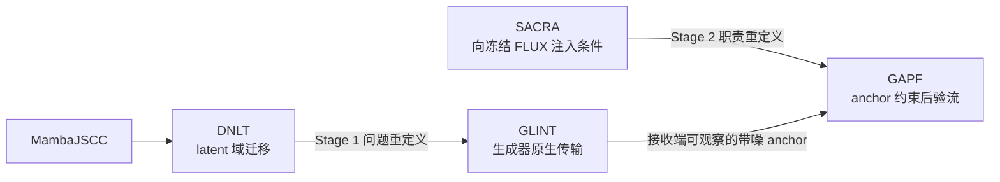

# GAPF-JSCC

[简体中文](README.md) | [English](README.en.md)

> **私有研究配套仓库。** 当前内容已经作者批准，用于集中保存论文依据、推理链与后续最小实现；在实验、正式评测、未决字段和权利审查全部闭合前，不构成公开发布或完整复现包。

GAPF-JSCC 研究如何把生成器原生 latent 的无线传输，与受 anchor 约束的冻结生成先验结合起来，实现兼顾来源忠实性与感知质量的图像重建。最终方法包含两个核心组件：

- **GLINT** 传输接收端生成器实际使用的原生 latent，并恢复一个空间对齐、完全由接收端可获得的 anchor。
- **GAPF** 将带噪 anchor 视为必须保护的来源证据，同时让冻结 rectified-flow prior 补全信道未能保留的信息。

本仓库不只保存最终代码，还保存论文背后的完整论证：问题定义、方法谱系、数学解释、验证结论、主张边界，以及后续从真实实现中抽取的最小代码。

## 当前状态

| 组成部分 | 当前状态 | 允许表述的结论 |
|---|---|---|
| GLINT | 所选工作点的 Stage 1 正式证据已经闭合 | 在已审计协议下，generator-native anchor 优于对应 DNLT comparator；更强的因果归因仍受 matched ablation 限制 |
| GAPF 架构 | 最终训练图与组件职责已经冻结 | 实现包含轨迹内证据注入，以及围绕冻结 prior 的有界终端动作 |
| GAPF 端到端评测 | 完整正式评测尚未闭合 | 不能声称已经全面优于所有匹配的重建和生成式基线 |
| 最小代码 | 发布边界已经定义，源码抽取尚待执行 | 不发布权重、官方复现配方、私有数据流程或完整评测器 |

## 方法谱系

四个方法和两条演进链分别说明。DNLT 与 SACRA 不会被写成“失败原型”：它们各自证明了一项被最终系统继承的能力，也暴露了必须重新定义问题的边界。

## 建议阅读顺序

- [问题定义](docs/problem-definition.md)：传输了什么、接收端知道什么，以及 source fidelity 为什么不等于无约束的语义合理性。
- [DNLT](docs/methods/dnlt.md) 与 [GLINT](docs/methods/glint.md)：两个完整、独立的 Stage 1 方法说明。
- [DNLT 到 GLINT](docs/lineage/dnlt-to-glint.md)：为什么最终变化并非简单更换 backbone。
- [SACRA](docs/methods/sacra.md) 与 [GAPF](docs/methods/gapf.md)：两个完整、独立的 Stage 2 方法说明。
- [SACRA 到 GAPF](docs/lineage/sacra-to-gapf.md)：为什么条件确实被模型使用，仍不足以保护接收证据。
- [核心相关工作综述](docs/related-work/core-review.md)：围绕通信任务建立 novelty 边界。
- [设计思想谱系](docs/related-work/design-genealogy.md)：扩散控制、图像修复、逆问题和特征压缩构成的来时路。
- [主张状态](docs/evidence/claim-status.md)：区分正式证据、诊断、解释与未闭合结论。

完整文档地图见 [docs/README.md](docs/README.md)。

## 本仓库包含什么

- 对论文高压缩方法描述的完整、面向读者的补充。
- 对 DNLT、GLINT、SACRA、GAPF 各自公平且独立的说明。
- GLINT 为什么替代 DNLT、GAPF 为什么替代 SACRA 的完整论证。
- 按设计问题组织，而不是套用统一论文卡片的相关工作分析。
- 防止训练流、smoke 或局部诊断冒充论文结果的证据边界。
- 经来源和许可审查后，从真实实现中抽取的 GLINT/GAPF 最小核心模块。

## 本仓库不包含什么

- 模型权重或 checkpoint。
- 私有或完整的数据处理流程。
- 未公开的关键训练配置和官方复现配方。
- 完整训练编排或正式评测器。
- 原始实验日志、任务对话、机器特定路径和临时诊断。
- 第三方论文 PDF，或直接复制的 MambaJSCC/FLUX 上游源码。

## 代码范围

计划中的代码发布服务于方法学习，而不是完整复现。它将保留 GLINT/GAPF 的真实算法流和关键不变量，用窄接口替代项目基础设施。详见 [src/README.md](src/README.md)。

## 论文范围

当前论文仍处于审阅阶段，GAPF 的完整正式结果仍有未闭合字段。建议纳入仓库的论文子集见 [paper/README.md](paper/README.md)；当前尚未将论文源文件复制到本仓库。

## 证据原则

所有科学表述必须属于以下一种状态：

- 已验证实现事实；
- 正式评测结果；
- 诊断或机制证据；
- 设计解释；
- 尚未闭合的主张。

只有正式证据可以支撑最终性能主张。设计解释用于帮助理解，不作为严格证明。详见 [证据与来源规则](docs/evidence/provenance-policy.md)。

## 参考资料与权利边界

仓库只提供原创分析、文献元数据和官方来源链接，默认不上传第三方 PDF。项目许可证尚未确定；在来源、许可和公开边界审查完成前，本仓库保持私有。

## 审阅与批准状态

作者已批准本轮初始内容与私有建仓。仍需闭合的内容边界和后续决策见 [REVIEW.md](REVIEW.md)。
